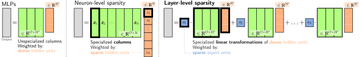
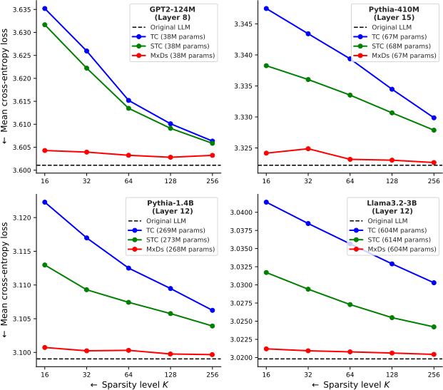

# Towards Interpretability Without Sacrifice: Faithful Dense Layer Decomposition with Mixture of Decoders

[](https://arxiv.org/abs/2505.21364)

[**James Oldfield**](https://james-oldfield.github.io/)<sup>1,2</sup>, [**Shawn Im**](https://shawn-im.github.io/)<sup>1</sup>, [**Yixuan Li**](https://pages.cs.wisc.edu/~sharonli/)<sup>1</sup>, [**Mihalis A. Nicolaou**](https://mihalisan.github.io/)<sup>3</sup>, [**Ioannis Patras**](https://www.eecs.qmul.ac.uk/~ioannisp/)<sup>2</sup>, [**Grigorios G. Chrysos**](https://grigorisg9gr.github.io/)<sup>1</sup>

<sup>1</sup>University of Wisconsin–Madison, <sup>2</sup>Queen Mary University of London, <sup>3</sup>The Cyprus Institute

> Multilayer perceptrons (MLPs) are an integral part of large language models, yet their dense representations render them difficult to understand, edit, and steer. Recent methods learn interpretable approximations via neuron-level sparsity, yet fail to faithfully reconstruct the original mapping--significantly increasing model's next-token cross-entropy loss. In this paper, we advocate for moving to layer-level sparsity to overcome the accuracy trade-off in sparse layer approximation. Under this paradigm, we introduce Mixture of Decoders (MxDs). MxDs generalize MLPs and Gated Linear Units, expanding pre-trained dense layers into tens of thousands of specialized sublayers. Through a flexible form of tensor factorization, each sparsely activating MxD sublayer implements a linear transformation with full-rank weights--preserving the original decoders' expressive capacity even under heavy sparsity. Experimentally, we show that MxDs significantly outperform state-of-the-art methods (e.g., Transcoders) on the sparsity-accuracy frontier in language models with up to 3B parameters. Further evaluations on sparse probing and feature steering demonstrate that MxDs learn similarly specialized features of natural language--opening up a promising new avenue for designing interpretable yet faithful decompositions.

---






## Model form

Please see: [form-equivalence.ipynb](./form-equivalence.ipynb) which introduces the MxD model form and its properties

## Experiments

The `transcoders` directory contains code for training and evaluating sparse MLP layers in LLMs. The meat of this folder is forked from [this repo](http://github.com/jacobdunefsky/transcoder_circuits).

We also use code from [SAEBench](https://github.com/adamkarvonen/SAEBench) to load in datasets for sparse probing. Thanks to these folks!

## Citation

If you find our work useful, please consider citing our paper:

```bibtex
@misc{oldfield2025interpretabilitysacrifice,
      title={Towards Interpretability Without Sacrifice: Faithful Dense Layer Decomposition with Mixture of Decoders}, 
      author={James Oldfield and Shawn Im and Yixuan Li and Mihalis A. Nicolaou and Ioannis Patras and Grigorios G Chrysos},
      year={2025},
      eprint={2505.21364},
      archivePrefix={arXiv},
      primaryClass={cs.LG},
      url={https://arxiv.org/abs/2505.21364}, 
}
```

## Contact

**Please feel free to get in touch at**: `j.a.oldfield@qmul.ac.uk`